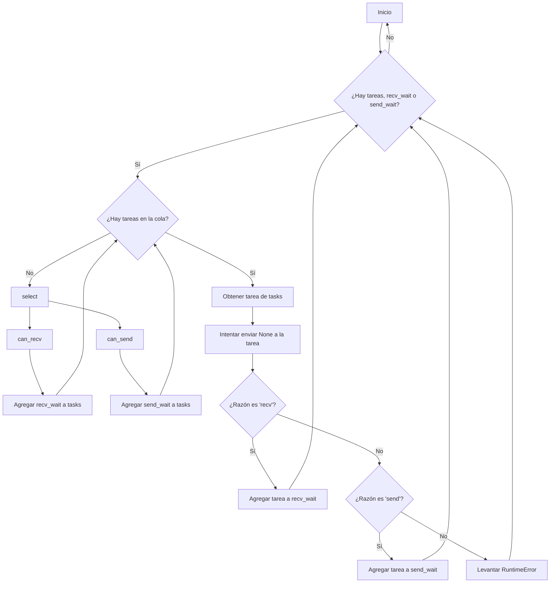

```mermaid
graph TD
    A[Inicio] --> B{¿Hay tareas, recv_wait o send_wait?}
    B -->|No| A
    B -->|Sí| C{¿Hay tareas en la cola?}
    C -->|No| D[select]
    D --> E[can_recv]
    D --> F[can_send]
    E --> G[Agregar recv_wait a tasks]
    F --> H[Agregar send_wait a tasks]
    G --> C
    H --> C
    C -->|Sí| I[Obtener tarea de tasks]
    I --> J[Intentar enviar None a la tarea]
    J --> K{¿Razón es 'recv'?}
    K -->|Sí| L[Agregar tarea a recv_wait]
    K -->|No| M{¿Razón es 'send'?}
    M -->|Sí| N[Agregar tarea a send_wait]
    M -->|No| O[Levantar RuntimeError]
    L --> B
    N --> B
    O --> B
```
